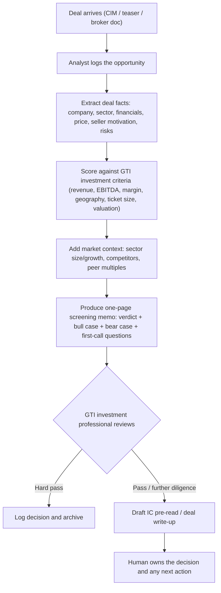
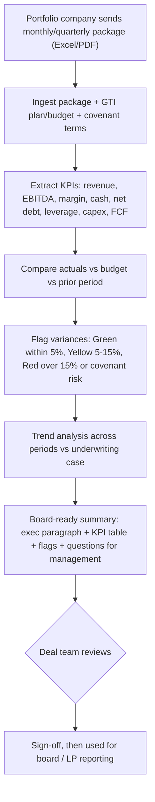
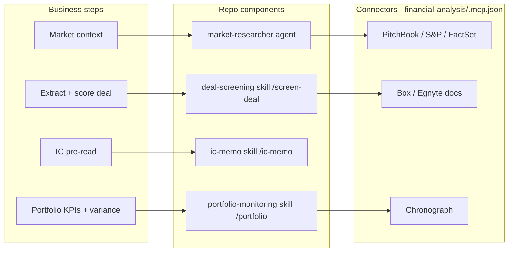
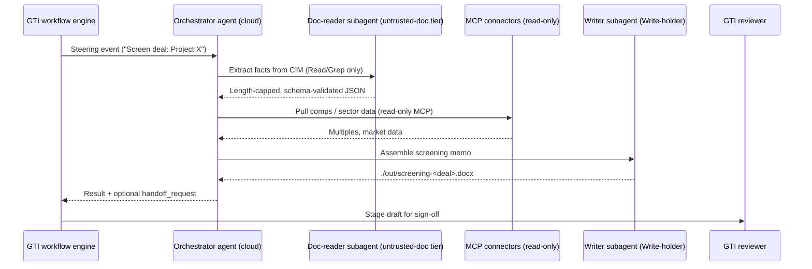

# GTI Agentic POC - Business Flow, Component Mapping & Cloud Hosting

Author: Code81 (Ghobash Group Technology Cluster)
Status: Pre-implementation design document
Scope: Deal screening + portfolio monitoring for Ghobash Trading & Investment (GTI)
Source repo: `anthropics/financial-services` (cloned in this workspace)

---

## 0. How to read this document

This document has three parts, by design, so business and technical readers can meet in the middle:

- Part A - what happens from a business perspective, step by step (no technology).
- Part B - how each business step maps to concrete Claude agent components already in this directory.
- Part C - what the flow looks like when the agent is hosted in the cloud (Anthropic Managed Agents), including security and data residency.

A short glossary sits at the end.

---

## Part A - Business perspective (step by step)

GTI is the PE/VC/multi-asset investment arm. We target two recurring workflows where an analyst spends hours on repetitive first-draft work.

### A.1 Workflow A - Inbound deal screening

Business goal: turn a stream of inbound opportunities (CIMs, teasers, broker emails) into a fast, consistent pass / further-diligence / hard-pass decision, with a one-page memo, so partners only spend time on deals worth a first call.

Step-by-step, in business terms:

1. Intake - a new opportunity lands. Today an analyst reads the whole document before knowing if it is even relevant.
2. Fact extraction - pull the deal's vital signs: what the company does, sector, revenue, EBITDA and margins, growth, asking price/multiple, why they are selling, customer concentration, obvious red flags.
3. Criteria screen - compare those facts to GTI's mandate (revenue/EBITDA bands, target margins, sectors in/out, geographies, ticket size, acceptable valuation). Each line gets a pass/fail.
4. Market context - position the company in its sector: market size and growth, who the competitors are, where comparable companies trade.
5. Screening memo - a single page: verdict (pass / further diligence / hard pass), 2-3 bullets bull case, 2-3 bullets bear case, and the key questions to ask on a first call.
6. Human review (gate) - a GTI professional accepts, rejects, or asks for changes. Nothing advances automatically.
7. Escalation - for deals that pass, draft an IC pre-read / write-up so the deal team starts from a structured document, not a blank page.

Human-in-the-loop gates: steps 6 and 7 are always reviewed and signed off by a person. The system drafts; GTI decides.

### A.2 Workflow B - Portfolio company monitoring

Business goal: every reporting cycle, turn each portfolio company's financial package into a board-ready performance summary with variances to plan flagged red/yellow/green, so the deal team sees problems early.

Step-by-step, in business terms:

1. Collection - the portfolio company submits its monthly/quarterly numbers (Excel workbook or PDF).
2. Ingest + reference data - load the package together with GTI's plan/budget for that company and any covenant terms.
3. KPI extraction - pull the financial vital signs (revenue, EBITDA and margin, cash, net debt, leverage, interest coverage, capex, free cash flow) plus sector-specific operational KPIs.
4. Variance analysis - actual vs budget vs prior period, in dollars and percent.
5. RAG flagging - Green (within 5% of plan), Yellow (5-15% behind, discuss), Red (more than 15% behind or covenant breach risk, immediate attention).
6. Trend - across multiple periods, is the business accelerating, decelerating, or stable, versus the original underwriting case.
7. Board-ready summary - one executive paragraph, a KPI table, the flags with context, and questions for management.
8. Human review (gate) - the deal team validates before anything is used for board or LP reporting.

---

## Part B - Mapping to Claude agent components in this directory

### B.1 The building blocks (what each component type is)

The repo is file-based (markdown + JSON/YAML, no build step). Four component types matter here:

- Agent - a named role with a system prompt that owns a workflow end to end. Lives in `plugins/agent-plugins/<slug>/agents/<slug>.md`.
- Skill - reusable domain know-how and a step-by-step method Claude applies when relevant. Lives in `plugins/vertical-plugins/<vertical>/skills/<skill>/SKILL.md`. Each named agent bundles a synced copy of the skills it needs.
- Command - an explicit slash action (for example `/screen-deal`). Lives in `plugins/vertical-plugins/<vertical>/commands/<name>.md`.
- Connector (MCP) - wires Claude to data (research platforms, document stores). Centralized in `plugins/vertical-plugins/financial-analysis/.mcp.json`.

Important reality check for this POC:

- There is a named agent for market research: [`market-researcher`](../plugins/agent-plugins/market-researcher/agents/market-researcher.md). We reuse it for the "market context" step.
- There is no prebuilt named agent for deal screening or portfolio monitoring. Those capabilities exist as private-equity skills and slash commands. For the POC we either (a) drive them as skills/commands inside Cowork, or (b) compose a new "deal-screener" agent from those skills (see Part C).
- The private-equity vertical ships no connectors of its own - [`private-equity/.mcp.json`](../plugins/vertical-plugins/private-equity/.mcp.json) is empty `{}`. All 12 connectors live in [`financial-analysis/.mcp.json`](../plugins/vertical-plugins/financial-analysis/.mcp.json).

### B.2 Workflow A mapped to components

- Business step "Extract deal facts" + "Score against criteria" -> skill [`deal-screening/SKILL.md`](../plugins/vertical-plugins/private-equity/skills/deal-screening/SKILL.md); slash command [`/screen-deal`](../plugins/vertical-plugins/private-equity/commands/screen-deal.md).
- Business step "Add market context" -> agent [`market-researcher`](../plugins/agent-plugins/market-researcher/agents/market-researcher.md), which itself invokes skills `sector-overview`, `competitive-analysis`, `comps-analysis`, `idea-generation`.
- Business step "Draft IC pre-read" -> skill [`ic-memo/SKILL.md`](../plugins/vertical-plugins/private-equity/skills/ic-memo/SKILL.md); slash command [`/ic-memo`](../plugins/vertical-plugins/private-equity/commands/ic-memo.md).
- Supporting (deeper diligence, optional) -> `dd-checklist`, `dd-meeting-prep`, `returns-analysis`, `value-creation-plan` skills under the same PE vertical.
- Data sources -> from `financial-analysis/.mcp.json`: PitchBook (private-company/deal data), S&P / FactSet / Daloopa (public comps), Box / Egnyte (document store for the CIMs). All paid; see POC data note below.

### B.3 Workflow B mapped to components

- Business steps "Extract KPIs" through "RAG flagging" and "Trend" -> skill [`portfolio-monitoring/SKILL.md`](../plugins/vertical-plugins/private-equity/skills/portfolio-monitoring/SKILL.md); slash command [`/portfolio`](../plugins/vertical-plugins/private-equity/commands/portfolio.md).
- Supporting analysis -> `returns-analysis` (vs underwriting case), `unit-economics` skills.
- Data sources -> Chronograph (PE portfolio monitoring connector) and document upload of the company package; reference plan/budget supplied by GTI.

### B.4 Mapping at a glance

POC data note: PitchBook, Chronograph, FactSet, S&P are paid subscriptions. For the POC we default to document-upload (feed CIMs and portfolio packages directly) plus any document store GTI already licenses, and avoid standing up the paid market-data connectors until value is proven.

---

## Part C - Flow when the agent is hosted in the cloud

"Hosted in the cloud" here means deploying as an Anthropic Managed Agent via `POST /v1/agents` rather than running interactively in Cowork on a desktop. The repo ships the deployment machinery; we describe how our two workflows would use it.

### C.1 Two hosting modes

- Mode 1 - Cowork (interactive, desktop/workspace): install the `financial-analysis`, `private-equity`, and `market-researcher` plugins; analysts drive skills and slash commands in a session. Fastest to stand up; recommended for POC Phase 1.
- Mode 2 - Managed Agents (cloud, headless): the same system prompt and skills are wrapped in an `agent.yaml` cookbook and deployed to `/v1/agents`. Triggered by events from GTI's own workflow engine; runs server-side with no human at a keyboard. Recommended for scale-out after the POC proves value.

The key design promise of the repo: same source, two wrappers. The system prompt and skills do not change between modes.

### C.2 How a cloud deployment is built

The reference deployer is [`scripts/deploy-managed-agent.sh`](../scripts/deploy-managed-agent.sh). Reading the script, deployment does the following for a cookbook (for example [`managed-agent-cookbooks/market-researcher/agent.yaml`](../managed-agent-cookbooks/market-researcher/agent.yaml)):

1. Resolve the manifest - inline `system.file` (the agent prompt) into a string; expand `skills.from_plugin` into one upload per skill folder.
2. Upload skills - each skill folder is zipped and POSTed to `/v1/skills` (beta header `skills-2025-10-02`), returning a `skill_id`.
3. Create subagents first - any `callable_agents` manifests are created via `/v1/agents` and referenced by id (children before parent).
4. Create the orchestrator - the top-level agent is POSTed to `/v1/agents` (beta header `managed-agents-2026-04-01`), referencing the uploaded skills and subagent ids.
5. Return an agent id + console URL.

For GTI we would author two cookbooks analogous to the market-researcher one:
- `deal-screener` - system prompt for screening; skills from the PE vertical (`deal-screening`, `ic-memo`, optionally `returns-analysis`); a callable `market-researcher` (or its `comps-spreader` leaf) for market context.
- `portfolio-monitor` - system prompt for monitoring; skills `portfolio-monitoring`, `returns-analysis`, `unit-economics`.

### C.3 Runtime flow in the cloud

- Trigger - GTI's own engine (the repo uses Temporal/Airflow/event-bus as examples) emits a steering event. See the shape in [`steering-examples.json`](../managed-agent-cookbooks/market-researcher/steering-examples.json), for example `"Primer: US data-center power, angle: supply gap"`. Our equivalent: `"Screen deal: Project X"` or `"Portfolio update: Company Y Q2"`.
- Orchestration - the orchestrator agent delegates to leaf subagents, calls read-only connectors, and assembles the output file under `./out/`.
- Handoffs - if a screened deal warrants modeling, the agent emits a `handoff_request` that the reference loop [`scripts/orchestrate.py`](../scripts/orchestrate.py) routes to another agent (for example `model-builder`) as a new steering event. Note `orchestrate.py` hard-allowlists target agents and schema-validates the payload before steering.

### C.4 Security model in the cloud (important for GTI data)

The cookbook README documents a three-tier isolation pattern (see [`managed-agent-cookbooks/market-researcher/README.md`](../managed-agent-cookbooks/market-researcher/README.md)) that we adopt for deal documents, since CIMs and broker materials are untrusted input:

- Reader tier - the only tier that touches untrusted documents; tools limited to `Read`/`Grep`, no connectors, returns length-capped schema-validated JSON. This is the prompt-injection containment boundary.
- Orchestrator / data tier - no direct untrusted-doc access; read-only connectors.
- Writer tier - the only tier with `Write`; never reads untrusted docs directly.

Additional Code81 governance wrapper:
- Own-cloud routing - run model traffic through Code81/GTI's own gateway (Bedrock/Vertex/internal) for data residency; relevant to UAE/KSA in-region requirements. The repo's Microsoft 365 install tooling and recent sovereign/national-cloud work support this pattern.
- Human sign-off - every artifact is staged for GTI review; the agents draft, they do not publish, recommend, or execute.
- Auditability - aligns to Code81's ISO 42001 (AI management), ISO 27001, and Dubai AI Seal posture; log inputs, outputs, and citations; enforce the repo's "cite every number or mark `[UNSOURCED]`" rule.

### C.5 Cowork vs cloud - quick comparison

- Trigger: Cowork = analyst in a session; Cloud = event from GTI's engine.
- Concurrency: Cowork = one user at a time; Cloud = many deals/companies in parallel.
- Human gate: both keep human sign-off; Cowork inline, Cloud stages drafts for review.
- Setup effort: Cowork = install plugins (low); Cloud = author cookbooks + deploy + wire engine (higher).
- Best for: Cowork = POC validation; Cloud = production scale-out.

---

## Open items / assumptions to confirm with GTI

- GTI's exact investment criteria (bands, sectors in/out, geographies, ticket size) - needed to configure screening.
- Which document store and market-data subscriptions GTI already holds (Box/Egnyte, PitchBook, FactSet, S&P, Chronograph).
- Plan/budget and covenant data format for portfolio monitoring.
- Hosting target for residency (own-cloud gateway vs Anthropic API direct).
- Output language(s) - English only or Arabic/English.

---

## Glossary

- Agent - a named role + system prompt that owns a workflow.
- Skill - a reusable method/knowledge file Claude applies automatically.
- Command - an explicit slash action that invokes a skill.
- Connector (MCP) - a server that wires Claude to external data, read-only here.
- Cookbook - the `agent.yaml` + subagents that package an agent for cloud deployment.
- Steering event - the input message that triggers a cloud-hosted agent.
- Handoff - one agent passing work to another via a validated request.
- RAG flag - Red/Amber/Green status (not retrieval-augmented generation).
