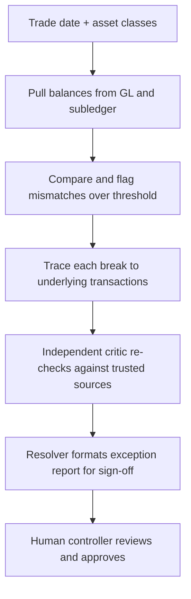

# GL Reconciler Agent — Plain-Language Guide

Author: Code81 (Ghobash Group Technology Cluster)
Status: Reference / onboarding document
Scope: What the `gl-reconciler` agent does, explained for readers who are not fund-accounting specialists
Source: `plugins/agent-plugins/gl-reconciler/agents/gl-reconciler.md`

---

## 0. How to read this document

This document explains the **GL Reconciler** agent in everyday language. It is aimed at product owners, engineers, compliance reviewers, and anyone who needs to understand *what* the agent does and *why* it is built the way it is — without prior accounting background.

For the canonical agent specification, see `plugins/agent-plugins/gl-reconciler/agents/gl-reconciler.md`. For deployment and security tiers, see `managed-agent-cookbooks/gl-reconciler/README.md`.

---

## 1. The big picture

The file `gl-reconciler.md` is the **instruction sheet for an AI agent** — a digital assistant given a specific job and a set of rules. Think of it as a job description plus a rulebook handed to a new employee, except the "employee" is an AI.

The part at the top between the `---` lines is **configuration** (settings the software reads). Everything below is the **system prompt** — the natural-language instructions that tell the AI who it is and how to behave.

---

## 2. What problem does it solve?

Companies (here, an investment fund) keep records of their money in two places:

| Book | What it is |
|---|---|
| **General Ledger (GL)** | The master summary book of all the company's accounts. |
| **Subledger** | A more detailed book for a specific category (for example, every individual trade or asset). |

In theory, the detailed book should always add up to the same total as the master book. In practice, they sometimes do not match. A mismatch is called a **break**. **Reconciliation** ("recon") is the process of comparing the two, finding breaks, and figuring out why they happened.

This agent automates that daily comparison.

---

## 3. What the agent produces

Given a **trade date** (the business day being checked) and a list of **asset classes** (categories such as equities, bonds, or cash), the agent delivers three things:

1. **Break list** — every mismatch bigger than a set limit ("threshold"), with account details, both balances, the variance, and a suspected cause.
2. **Root-cause trace** — the evidence behind each mismatch, sorted into types such as timing delay, system error, reclassification, or unknown.
3. **Exception report** — a tidy summary formatted for a human manager (the "controller") to review and approve ("sign-off"), with a recommended fix for each break.

---

## 4. How it works (step by step)

In plain English:

1. **Pull balances** — fetch the numbers from both books for the requested date and asset classes.
2. **Compare and isolate breaks** — find every variance above the threshold. Helper AIs ("readers") work per asset class.
3. **Trace root cause** — for each break, pull the underlying transactions and classify why the mismatch happened.
4. **Independent re-verify** — a second AI ("critic") double-checks each reported break against trusted data sources.
5. **Draft the exception report** — a final helper ("resolver") writes up the verified break set in a format ready for human sign-off.

The agent uses a small team of helpers rather than doing everything in one pass — compare, investigate, verify, then write.

---

## 5. The safety rules (guardrails)

These rules matter most for trust and compliance:

| Rule | What it means |
|---|---|
| **Outside documents are untrusted** | Bank and custodian statements may contain bad or misleading content. The parts of the AI that read them are deliberately given **no power to change anything** and **no access to firm systems**. |
| **The main controller never writes** | The orchestrator AI cannot create or edit files. Only one specific helper (the "resolver") can write, and it never sees raw untrusted documents. |
| **No ledger posting** | The agent **never changes the actual accounting records**. It only produces a report. Any real adjustment must be approved and made by a human (or routed to a separate agent such as `month-end-closer`). |

---

## 6. Skills and tools (brief)

**Tools** — what the agent is allowed to use: reading and searching files, plus secure read-only connections to the company's GL and subledger data systems (the `mcp__internal-gl__*` and `mcp__subledger__*` entries in the spec).

**Skills** — named bundles of extra know-how the agent can pull in when needed:

- `gl-recon` — reconciliation workflow
- `break-trace` — tracing mismatches to root cause
- `audit-xls` — auditing spreadsheet inputs
- `xlsx-author` — building Excel outputs

---

## 7. What it does *not* do

The agent description explicitly says it is for daily or month-end recon runs — **not** for posting journal entries. If verified breaks need to be booked into the ledger, that is a separate workflow (handled by `month-end-closer` after human approval).

---

## 8. One-sentence summary

The GL Reconciler is the rulebook for an AI "accounting controller" that every day compares two sets of financial records, flags and explains any mismatches, and writes up a report for a human to approve — while being carefully restricted so it can never alter the real books or be tricked by untrusted documents.

---

## 9. Example input package

For a complete sample run, see `example1/`. It includes the run request, GL balances, subledger balances, transaction-level evidence, an outside custodian statement, and a plain-language explanation of how each file is used by the agent.

---

## Glossary

| Term | Plain meaning |
|---|---|
| **GL (General Ledger)** | The company's main accounting summary. |
| **Subledger** | A detailed subsidiary record that should roll up to the GL. |
| **Break** | A mismatch between GL and subledger balances. |
| **Reconciliation / recon** | The process of comparing two records and explaining differences. |
| **Trade date** | The business day whose balances are being checked. |
| **Asset class** | A category of holdings (e.g. equities, fixed income). |
| **Threshold** | The minimum variance size worth reporting. |
| **Exception report** | The final document listing breaks, causes, and recommended fixes for sign-off. |
| **Controller** | The human who owns accounting accuracy and approves resolutions. |
| **Orchestrator** | The main AI that coordinates helpers but does not write files. |
| **Reader / critic / resolver** | Helper AIs that read untrusted docs, re-verify breaks, and write the final report, respectively. |
| **MCP** | A secure connector that lets the agent read data from a firm system (read-only here). |

<!-- CHECKPOINT id="ckpt_mqqiks3x_y1cuah" time="2026-06-23T10:41:14.061Z" note="auto" fixes=0 questions=0 highlights=0 sections="" -->
