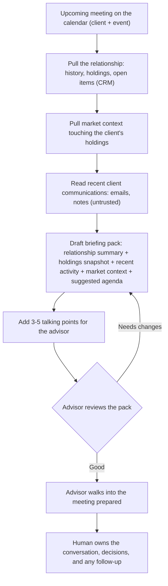
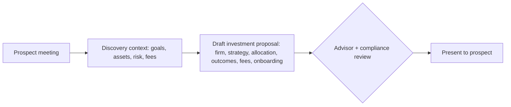
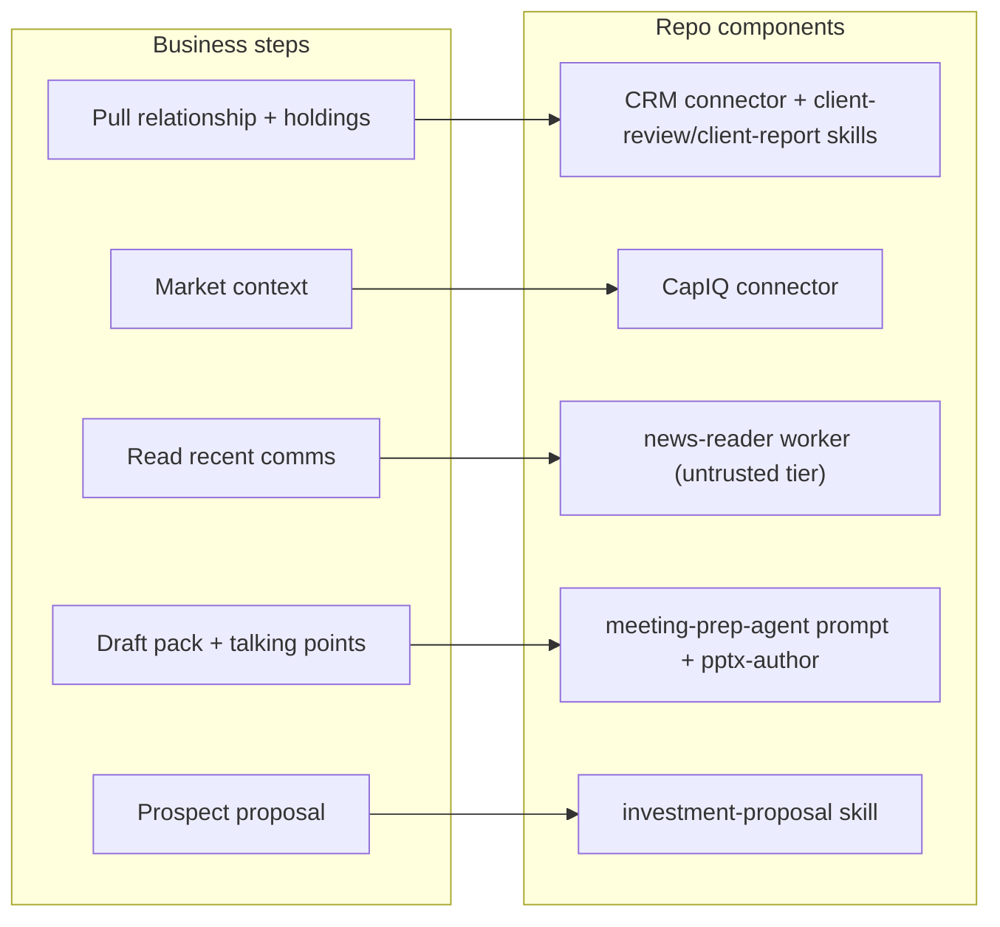
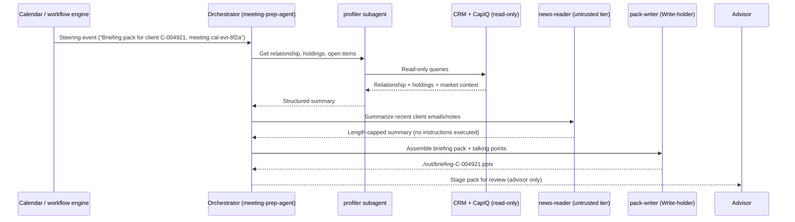

# Meeting Prep Agent - Business Flow, Component Mapping & Cloud Hosting

Author: Code81 (Ghobash Group Technology Cluster)
Status: Pre-implementation design document
Scope: Pre-meeting client briefing packs for advisors / relationship managers
Source repo: `anthropics/financial-services` (cloned in this workspace)

---

## 0. How to read this document

Three parts, by design, so business and technical readers can meet in the middle:

- Part A - what happens from a business perspective, step by step (no technology).
- Part B - how each business step maps to concrete Claude agent components already in this directory.
- Part C - what the flow looks like when the agent is hosted in the cloud (Anthropic Managed Agents), including security and data residency.

A short glossary sits at the end. This mirrors the structure of the GTI POC document so the two can be read side by side.

---

## Part A - Business perspective (step by step)

Business goal: before every client (or prospect) meeting, give the advisor a ready briefing pack - who the client is, what they hold, what changed, what to talk about - so the advisor walks in prepared instead of spending an hour assembling it by hand. The pack is for the advisor only; it is never sent to the client.

Where this fits Code81 / Ghobash: directly applicable to a wealth-management or private-banking relationship desk; adaptable for GTI investor-relations (LP/co-investor meetings) and portfolio-company board prep by swapping the data sources and templates.

### A.1 The standard pre-meeting flow



Step-by-step, in business terms:

1. Trigger - a client meeting is coming up (a calendar event). The advisor needs to prepare. Inputs are simply which client and which meeting.
2. Pull the relationship - relationship history, household members, account/holdings snapshot, and any open items or action points outstanding from last time.
3. Pull market context - recent market events that actually touch this client's holdings (not generic market noise).
4. Read recent communications - the last emails and notes from the client, summarized so the advisor remembers the live threads. This content is treated as untrusted (see security).
5. Draft the briefing pack - a single, structured pack: relationship summary, holdings snapshot, recent activity, relevant market context, and a suggested meeting agenda.
6. Talking points - three to five concrete items the advisor should raise.
7. Advisor review (gate) - the advisor reads, edits, or regenerates. Nothing is auto-sent and nothing goes to the client.

### A.2 Prospect variant (new client pitch)

For a prospect rather than an existing client, the same trigger leads to an investment proposal instead of a holdings review: firm overview, understanding-your-needs, proposed strategy and allocation, expected outcomes, fees, and a getting-started plan. Same human-review gate applies, plus a compliance check before anything is presented.



Human-in-the-loop gates: the advisor signs off on every pack; for prospect proposals, compliance reviews before presentation. The agent drafts; it does not send, advise, or transact.

---

## Part B - Mapping to Claude agent components in this directory

### B.1 The building blocks (recap)

The repo is file-based (markdown + JSON/YAML, no build step). Four component types matter here:

- Agent - a named role with a system prompt that owns a workflow. Lives in `plugins/agent-plugins/<slug>/agents/<slug>.md`.
- Skill - reusable domain method Claude applies when relevant. Lives in `plugins/vertical-plugins/<vertical>/skills/<skill>/SKILL.md`; the agent bundles a synced copy of each.
- Command - an explicit slash action. Lives in `plugins/vertical-plugins/<vertical>/commands/<name>.md`.
- Connector (MCP) - wires Claude to data, read-only here.

Unlike the deal-screening workflow, meeting prep already ships as a prebuilt named agent: [`meeting-prep-agent`](../plugins/agent-plugins/meeting-prep-agent/agents/meeting-prep-agent.md). Its source skills live in the wealth-management vertical.

### B.2 The agent and what it declares

From [`meeting-prep-agent.md`](../plugins/agent-plugins/meeting-prep-agent/agents/meeting-prep-agent.md):

- Tools declared: `Read`, `Write`, `mcp__crm__*`, `mcp__capiq__*`.
- Produces: a briefing pack (relationship summary, holdings snapshot, recent activity, open items, market context, suggested agenda) plus 3-5 talking points.
- Bundled skills: `client-review`, `client-report`, `investment-proposal`, `pptx-author`.

### B.3 Business steps mapped to components

- "Pull the relationship" -> CRM connector (`mcp__crm__*`). Important: there is no CRM connector shipped in the repo. The 12 connectors in [`financial-analysis/.mcp.json`](../plugins/vertical-plugins/financial-analysis/.mcp.json) do not include a CRM; the firm wires its own (Salesforce, Dynamics, or GTI's investor-relations system) and supplies it as `CRM_MCP_URL`.
- "Pull market context" -> CapIQ connector (`mcp__capiq__*`), which maps to the S&P Global / Kensho connector (`sp-global` in `financial-analysis/.mcp.json`), supplied as `CAPIQ_MCP_URL`.
- "Read recent communications" -> handled by a dedicated reader worker in the cloud build (the `news-reader` subagent); client content is untrusted.
- "Draft briefing pack" -> skill [`client-review/SKILL.md`](../plugins/agent-plugins/meeting-prep-agent/skills/client-review/SKILL.md) for the relationship/performance summary and [`client-report/SKILL.md`](../plugins/agent-plugins/meeting-prep-agent/skills/client-report/SKILL.md) for the holdings section.
- "Talking points" + "suggested agenda" -> produced by the agent prompt synthesizing the above.
- Prospect variant -> skill [`investment-proposal/SKILL.md`](../plugins/agent-plugins/meeting-prep-agent/skills/investment-proposal/SKILL.md).
- Output formatting / slides -> skill `pptx-author` (bundled).

Source skills and related slash commands live in the wealth-management vertical (which itself ships no connectors - no `.mcp.json`): commands [`/client-review`](../plugins/vertical-plugins/wealth-management/commands/client-review.md), [`/client-report`](../plugins/vertical-plugins/wealth-management/commands/client-report.md), [`/proposal`](../plugins/vertical-plugins/wealth-management/commands/proposal.md), plus `/financial-plan`, `/rebalance`, `/tlh` for adjacent workflows.

### B.4 Mapping at a glance



POC data note: the CapIQ/S&P connector is a paid subscription, and the CRM connector must be built/configured against GTI's own system. For an initial POC we can stub the relationship data with exported CRM records (document upload) and limit market context to what the firm already licenses.

---

## Part C - Flow when the agent is hosted in the cloud

"Hosted in the cloud" means deploying as an Anthropic Managed Agent via `POST /v1/agents` rather than running interactively in Cowork. The repo ships both wrappers from the same source.

### C.1 Two hosting modes

- Mode 1 - Cowork (interactive): install the `meeting-prep-agent` plugin (and the wealth-management vertical); the advisor runs it in a session. Fastest to validate.
- Mode 2 - Managed Agents (cloud, headless): the same prompt and skills wrapped in [`managed-agent-cookbooks/meeting-prep-agent/agent.yaml`](../managed-agent-cookbooks/meeting-prep-agent/agent.yaml), triggered by calendar events from the firm's workflow engine. For scale - every advisor's meetings prepped automatically overnight.

### C.2 How the cloud deployment is built

The deployer is [`scripts/deploy-managed-agent.sh`](../scripts/deploy-managed-agent.sh). For this agent:

```bash
export ANTHROPIC_API_KEY=sk-ant-...
export CRM_MCP_URL=...   CAPIQ_MCP_URL=...
scripts/deploy-managed-agent.sh meeting-prep-agent
```

The script: inlines the system prompt, zips and uploads each skill to `/v1/skills`, creates the subagents first, then POSTs the orchestrator to `/v1/agents`. The cookbook declares three leaf subagents:

- `profiler` - relationship/holdings lookup; CRM + CapIQ read-only; does not touch untrusted docs.
- `news-reader` - the untrusted-doc tier; reads client emails/notes; `Read`/`Grep` only, no connectors.
- `pack-writer` - the only Write-holder; assembles `./out/briefing-<client>.pptx`; never opens client content directly.

### C.3 Runtime flow in the cloud



Trigger shapes are in [`steering-examples.json`](../managed-agent-cookbooks/meeting-prep-agent/steering-examples.json), for example `"Briefing pack for client C-004921, meeting cal-evt-8f2a"`, a prospect with no CRM record, or a same-day `"Refresh holdings + market context only"`.

### C.4 Security model in the cloud

Client emails and inbound documents are untrusted input, so the cookbook README defines a three-tier isolation pattern (see [`managed-agent-cookbooks/meeting-prep-agent/README.md`](../managed-agent-cookbooks/meeting-prep-agent/README.md)):

- `profiler` tier - no untrusted-doc access; CRM + CapIQ read-only.
- `news-reader` tier - the only tier that reads untrusted client content; `Read`/`Grep` only, no connectors. This is the prompt-injection containment boundary.
- `pack-writer` tier - the only tier with `Write`; never reads untrusted content directly.

Plus the Code81 governance wrapper (same as the GTI doc): own-cloud routing for data residency (UAE/KSA), human sign-off on every pack, no client-facing send, and audit/citation discipline aligned to ISO 42001 / ISO 27001 / Dubai AI Seal. Client PII makes residency and access control especially important here.

### C.5 Cowork vs cloud - quick comparison

- Trigger: Cowork = advisor in a session; Cloud = calendar event from the engine.
- Concurrency: Cowork = one prep at a time; Cloud = every advisor's daily meetings prepped in batch.
- Human gate: both keep advisor sign-off; client-facing send never automated.
- Setup effort: Cowork = install plugin + wire CRM (medium); Cloud = author/deploy cookbook + wire engine + CRM (higher).
- Best for: Cowork = POC; Cloud = firm-wide rollout.

---

## Open items / assumptions to confirm

- Which CRM/relationship system to connect, and whether an MCP connector exists or must be built (`CRM_MCP_URL`).
- Market-data entitlement for CapIQ / S&P (`CAPIQ_MCP_URL`).
- Holdings/custody data source and format.
- Client PII handling, residency, and access controls.
- Output language(s) - English only or Arabic/English - and firm branding/template for the pack.
- Whether the prospect-proposal variant is in scope for the first phase.

---

## Glossary

- Agent - a named role + system prompt that owns a workflow.
- Skill - a reusable method/knowledge file Claude applies automatically.
- Command - an explicit slash action that invokes a skill.
- Connector (MCP) - a server that wires Claude to external data, read-only here.
- Cookbook - the `agent.yaml` + subagents that package an agent for cloud deployment.
- Steering event - the input message that triggers a cloud-hosted agent.
- Untrusted tier - the isolated subagent allowed to read client-provided content, with no connectors and no write access.
- Briefing pack - the advisor-only output: relationship summary, holdings, activity, market context, agenda, talking points.
